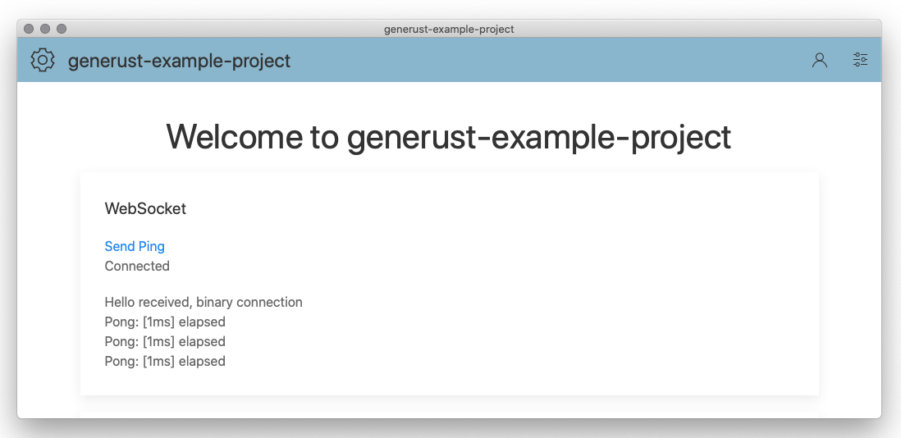
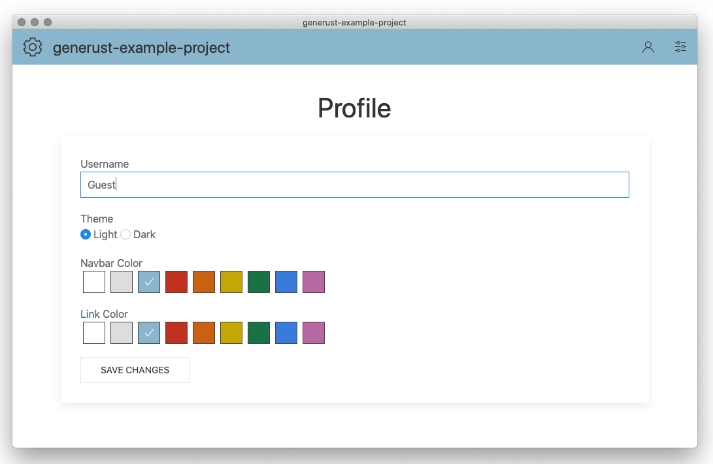
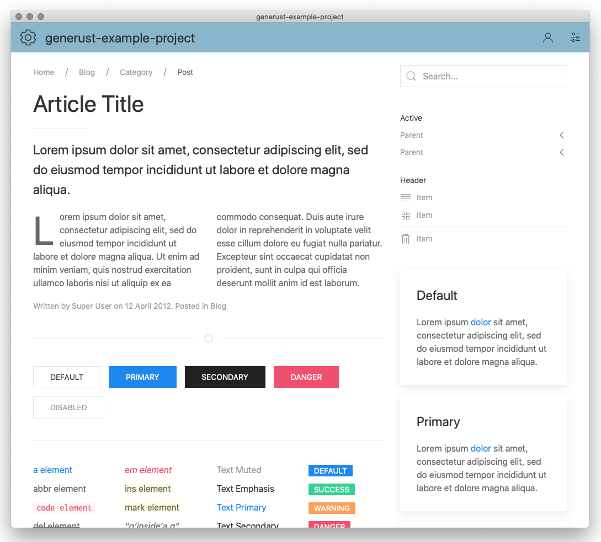
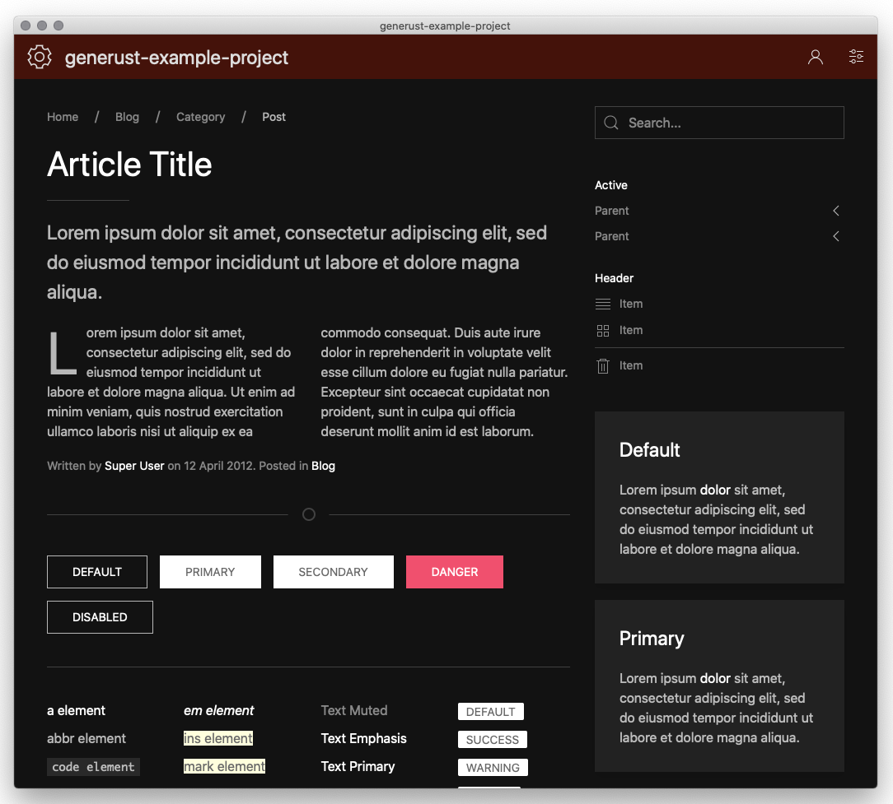
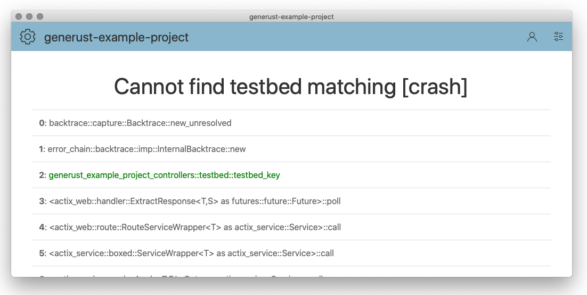

# Generust

[](License)

## A Rust project template for dynamic web applications

`Generust` is a [cargo-generate](https://github.com/ashleygwilliams/cargo-generate) template that provides a Rust web server and WASM client with some [interesting features](doc/features.md).

It uses [actix-web](https://actix.rs), [maud](https://maud.lambda.xyz), [UIKit](https://getuikit.com), and [wasm-bindgen](https://github.com/rustwasm/wasm-bindgen) to serve your app as a server or webview, via HTTP and WebSockets.

Rust nightly is required, at least for now

## Screenshots


Normally started as a server, Generust also embeds a webview, allowing you to run a standalone instance.


User profile settings allow you to set your name and theme.


UIKit integration and reverse routing make designing attractive pages simple.


I don't get it, but some of you love Dark Mode. Well, here it is.


Custom error pages show detailed traces (or custom error pages)

## Example Projects

[generust-example-project](https://github.com/kyleu/generust-example-project) - Basically just the result of running this template

## Use `cargo generate` to clone this template and make it your own

```script
cargo install cargo-generate
cargo generate --git https://github.com/kyleu/generust.git --name my-project
cd my-project
./bootstrap
```

This will package the WASM client, compile the UIKit SCSS, and build the main application.
You can execute `cargo run` to start the server and open a system webview pointing to it, or run `solitaire -h` to see the CLI options.
[Scripts](doc/scripts.md) are provided in `./bin` that will help you build and publish the app.

Good luck!

## Your Project

After you've created your project, the variables in this file will be replaced with your project's information, just remove this section and the lines above it.

# solitaire

[](https://travis-ci.org/solitaire/solitaire)
[](https://crates.io/crates/solitaire)
[](https://docs.rs/solitaire)
[](https://deps.rs/repo/github/solitaire/solitaire)

solitaire is a work in progress...

Running as a client application or shared server, `solitaire` has a focus on performance, correctness, and developer comfort.

See [installing.md](doc/installing.md) for installation guidance. After installing, run `solitaire -h` to get started.

See [scripts.md](doc/scripts.md) for available tools for building, running, and packaging the app.

## Crates

`solitaire` splits its code into several library crates:

- `solitaire-assets`: Contains embedded static files intended to be served from the web application
- `solitaire-client`: Run in the client's browser as a WebAssembly package, includes templates
- `solitaire-controllers`: Contains actix-web HTTP controllers, usually calling methods from `solitaire-service`
- `solitaire-core`: Contains definitions that are shared between server and client
- `solitaire-service`: Contains the primary logic for the application. It receives RequestMessages and emits ResponseMessages
- `solitaire-templates`: Contains Maud templates used by the server to render responses
- `solitaire`: Stored in the root of the project, this is the app's main library and binary

## Config

The project currently exclusively uses the filesystem for saved data, no database is involved.

### Directories

By default, solitaire stores config files in your system's user configuration directory.

- macOS: ~/Library/Application Support/solitaire
- Linux: ~/.config/solitaire
- Windows: %APPDATA%/solitaire/solitaire

### Files

`profile/*`: User profile information
